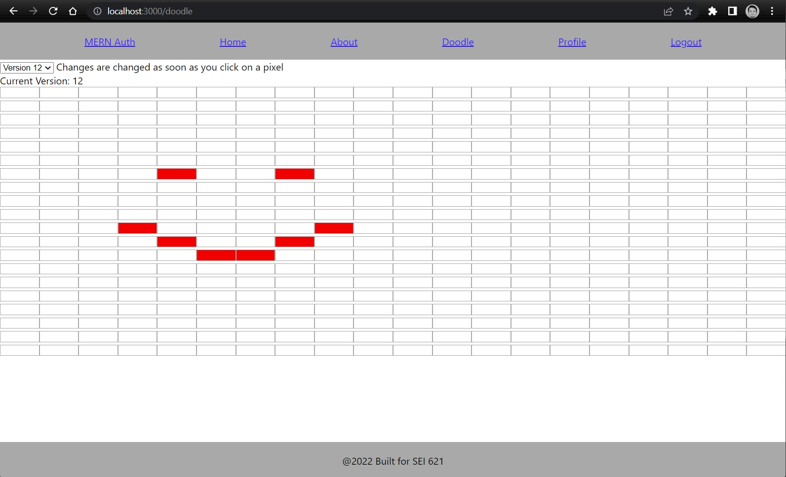

# Doodle history app

This is a simple web app that allows a user to log into the site with an email and password and then draw a piece 20x20 of pixel art. 

This app will save each new pixel added to the drawing and will allow the user to rewind their drawing, as in, visit the state of the drawing for each pixel placed. This drawing will be stored in mongoDB via our backend application with an association to our user that we used to log in with. 

The goals of the project are to challenge you to implement some more complex mongoDB models, as well as some more complex and algorithmically rigorous frontend data manipulation logic. We also hope to reinforce the fundamentals of MERN stack by building off the same template we used for project 3 and by providing you an excuse to get some additional MERN stack reps in. 

## Authentication

We'll be using the Authentication boiler plate form project 3, and will be using the user created to associate our drawing to. 

We will be using a JWT for our authentication(like in project 3) please review the postman collections in the backend project to see how we're storing our token in postman and how we're passing that token to our API.

Feel free to style this page in a way that you feel is challenging you and your CSS skills. 


## Draw page(baseURL/doodles)

The guts of our application will be inside of the doodle Page. You will click on each cell on the draw page to add a red pixel, this change will be passed to the backend and will be stored for your user in mongodb. You can also see on the top left corner of the page, there is a version dropdown(should be between 0-n), this will allow you to rewind your actions used to draw your pixel art. 


this image is of our 3rd pixel edit.

When we click on new cells we will create a new version, if we click on a red cell it will be updated to white, and when we click on a white cell it will be updated in a new version with a red cell. 

See how when we draw a smiley face, we will have added 9 additional versions for the individual pixel updates. 



# Setup

Please install npm packages with 

```
npm i
```

then ensure that you have the backend project running and your local mongodb instance running(or atlas connection added to backend).

You must also include a .env file that looks like this 

```
REACT_APP_SERVER_URL=http://localhost:5000
```

our backend project is configured to run on PORT 5000. 

# Steps

We will challenge you all to create this doodle app with the functionality to rewind our drawing using react on our frontend. 

## Create the doodle pad component

This will be a react component built of an n by n array of child react components

### Create doodle cell component

### Create rewind dropdown component
